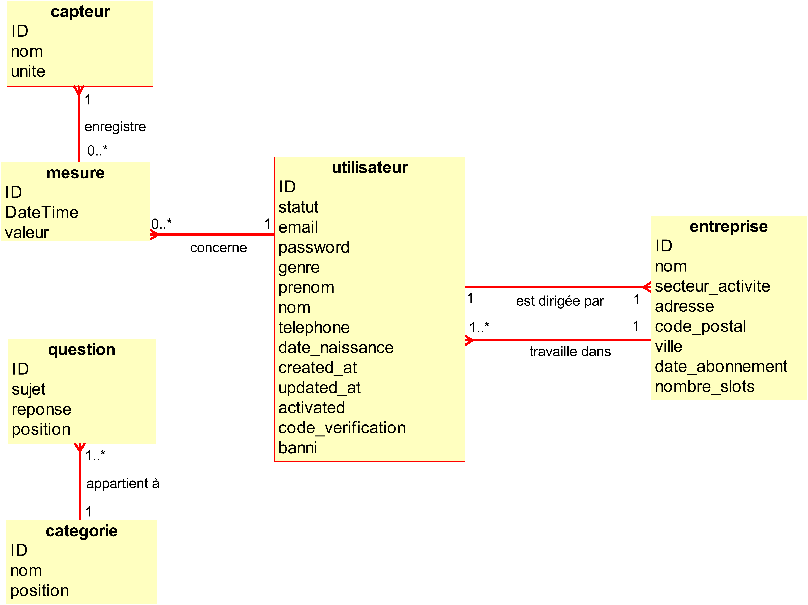

# Better Labor: Connected Headset Management Platform


## Introduction

The **Better Labor Connected Headset Management Platform** is a web application designed to manage users, and health and environmental data for workers using connected headsets. The project was developed as part of a year-long collaboration among five engineering students at a French engineering school. This repository contains the **Computer Science** component of the project, creating the user interface for administrators, company managers, and workers. The goal was to allow real-time monitoring and management of environmental factors like CO2 levels, sweat, heart rate, and sound exposure to ensure workers' well-being.
*However, it is only part of the overall project and requires the results of the  Electronics, Signal Processing and Telecommunications components to integrate headset data to the dashboard in real-time.*

This project allowed me to develop a wide range of skills, including full-stack development, database management, and user experience design, which isn't exactly my strong suit. I contributed extensively to the project, which is why I have forked this repository.

---


## Features & Functionality

The Better Labor platform is built to support a range of functionalities tailored to different user roles, focusing on monitoring environmental factors for workers and enabling smooth management for company administrators and managers.

### User Roles

The platform distinguishes between three main user roles: administrators, company managers, and workers, each with specific functionalities.

- **Administrators**: 
  - Have access to an administrative dashboard where they can:
    - Manage users: add, update, or remove both company managers and workers.
    - Oversee the content of the platform, such as managing FAQs and quizzes.
    - Generate secure activation codes for new administrators.
    - View and analyze platform activity.
  
- **Company Managers**:
  - Have access to the manager dashboard, which allows them to:
    - Add, modify, or remove workers.
    - View environmental data from their workers' headsets, such as CO2 levels, heart rate, and noise exposure.
    - Take action based on the data, such as sending warnings or recommendations (e.g., rehydration alerts based on sweat levels).
    - Access the FAQ and quizzes related to worker safety.

- **Workers**:
  - Workers can log into their personal dashboard, where they can:
    - View real-time and historical data from their connected headsets, which monitors environmental factors like CO2, noise, sweat, and heart rate.
    - Manage their account settings and update personal information.
    - Take quizzes to learn about workplace hazards and earn badges based on their scores.
    - Receive feedback on their health and environmental conditions directly from the dashboard.

### Environmental Monitoring

The platform integrates data from connected headsets worn by workers on construction sites. These headsets measure:
- **CO2 Levels**: To monitor air quality and warn workers of unsafe levels.
- **Heart Rate**: For detecting abnormal heart rate levels, which might indicate over-exertion or other health issues.
- **Sweat Detection**: Provides rehydration alerts based on the amount of sweat detected.
- **Noise Levels**: Ensures that workers are not exposed to dangerous levels of noise pollution.

All this data is presented to workers and managers through an intuitive dashboard, where real-time metrics and historical trends are easily accessible.

### Content Management

The platform allows administrators to manage all textual content, including:
- **FAQs**: Frequently Asked Questions can be created, edited, and deleted by the administrators. The FAQ section helps answer common queries related to the platform and workplace safety.
- **Quizzes**: Quizzes can be created to educate workers on workplace hazards. Workers can take quizzes and earn badges based on their performance, which is reflected in their profiles.
  
### User Management

Administrators and managers can manage users in their respective dashboards:
- **Administrators** can manage both company managers and workers. They have the ability to create new administrator accounts and manage permissions.
- **Managers** can only manage their assigned workers, adding or removing them as necessary. They can also monitor workers’ health and environmental data in real-time.

### Quiz System

The platform includes an educational component in the form of quizzes. Workers can take quizzes to:
- Learn about potential workplace dangers, including CO2 exposure, dehydration risks, and noise-induced hearing loss.
- Earn badges for their profile based on quiz performance.

---


## Project Structure

Although the project does not follow the traditional MVC architecture, it is logically structured with reusable functions and files organized by feature. Most of the file and function names are in French. The key components are:

### Entity-Relationship Diagram (ERD)
Below is the Entity-Relationship Diagram of the database.




### Root Files

- **`index.php`**: 
  - This file serves as the entry point to the application. It loads the homepage, which provides users with an overview and allows them to navigate to different parts of the platform depending on their roles (worker, manager, or administrator). It includes general content and logic to route users to their specific dashboard areas.
  
- **`faq.php`, `faq.js`, `faq.css`**: 
  - **`faq.php`**: This PHP file manages the FAQ (Frequently Asked Questions) page, retrieving questions and answers from the database and displaying them to the users. It handles requests for adding, updating, and deleting FAQ entries (for admins) and displays these in a user-friendly format.
  - **`faq.js`**: This JavaScript file enhances user interaction on the FAQ page, including dynamic searching and filtering of questions. It also supports FAQ submission or editing via AJAX without reloading the page.
  - **`faq.css`**: Styles the FAQ page, making it visually appealing and ensuring proper layout for FAQ entries.

- **`send_mail.php`**: 
  - This file handles all email-related functionality within the platform. It uses the PHPMailer library to send emails for account verification, password recovery, or notifications. It's responsible for crafting and sending the emails based on specific events or triggers, such as when a user signs up or requests a password reset.

- **`cgu.php` & `CGU.pdf`**: 
  - **`cgu.php`**: This file displays the "Conditions Générales d'Utilisation" (Terms of Use) on the website. Users are required to agree to these terms when they sign up. 
  - **`CGU.pdf`**: A downloadable PDF version of the Terms of Use that users can access from the `cgu.php` page.

- **`contact.php`, `contact.js`, `contact.css`**: 
  - **`contact.php`**: The backend logic for the contact form, allowing users to send inquiries or feedback to the site administrators. It typically sends emails to the admin team via the `send_mail.php` function.
  - **`contact.js`**: Adds dynamic behavior to the contact form, ensuring that fields are validated before submission and allowing AJAX form submission to avoid page reloads.
  - **`contact.css`**: Contains the styling for the contact page to ensure the form looks clean and responsive across devices.

- **`nav.php`**: 
  - A reusable file for the main navigation menu. It is included across several pages of the project to ensure consistent navigation. This file dynamically adjusts the menu based on the logged-in user's role (worker, manager, admin), displaying the appropriate links and options.

- **`barre_accueil.php`, `barre_profil.php`, `barre_accueil.css`, `barre_profil.css`**: 
  - These files are responsible for rendering the header/navigation bar specific to the homepage (`barre_accueil.php`) and profile pages (`barre_profil.php`). The PHP files provide the structure and logic for generating the header, while the corresponding CSS files (`barre_accueil.css`, `barre_profil.css`) style them.

- **`footer.php`, `footer.css`**: 
  - **`footer.php`**: This file generates the footer that appears on all pages, including links to the privacy policy, terms of use, and other important information.
  - **`footer.css`**: Styles the footer, ensuring that it remains at the bottom of the page and has a consistent appearance across all screens.

- **`general.css`**: 
  - A general stylesheet that applies global styles to the entire application, such as font settings, default button styles, layout structure, and other reusable styles that are applied site-wide.

### Folders

#### `database/`

This folder contains files responsible for interacting with the database, including user management, account actions, and data fetching.

- **`betterlabor.sql`**: SQL file used to set up the project's MySQL database.
- **`config.php`**: Configuration file for database connection details.
- **`connexion.php`**: Handles user login and session management.
- **`fetch_data.php`**: Retrieves data from the database, often used for dynamic page content.
- **`gestion_profil.php`**: Manages user profile updates (e.g., password changes, account details).
- **`inscription.php`**: Handles user sign-up logic.
- **`reinitialisation_mdp.php`**: Logic for resetting passwords.
- **`suppression_compte.php`**: Handles user account deletion.
- **`tools.php`**: Contains utility functions used throughout the database operations.

#### `espace-admin/`

The admin section of the project allows administrators to manage users, FAQs, and other site content.

- **`connexion.php`**: Login page for administrators.
- **`espace-admin.css`**: Styles for the admin dashboard.
- **`FAQManager.php`**: Handles CRUD operations (Create, Read, Update, Delete) for the FAQ content.
- **`gestion_faq.php`, `gestion_faq.js`**: Manage the FAQ entries, including both server-side logic and front-end interactivity.
- **`gestion_utilisateurs.js`**: JavaScript for managing users within the admin dashboard.
- **`index.php`**: The main page of the admin dashboard.
- **`inscription.php`, `inscription.js`**: Logic for admin or manager sign-up.
- **`sidebar.php`**: The sidebar component used across all admin pages for navigation.

#### `espace-chef/`

This folder contains all files related to the workspace for **company managers**. Managers can view and manage their workers' environmental data and company information.

- **`ajout_employés.php`, `ajout_employés.css`**: Form and styles for adding new employees to the system.
- **`index.php`**: Manager’s main dashboard.
- **`inscription.php`, `inscription.js`**: Handles manager sign-up and worker management logic.
- **`sidebar.php`**: Sidebar component for easy navigation in the manager’s workspace.

#### `espace-membre/`

The workspace for **workers** using the connected headsets, allowing them to view personal environmental data, take quizzes, and manage their profile.

- **`donnees.php`, `donnees.css`, `donnees.js`**: Displays and styles the environmental data collected by the worker's connected headset, including heart rate, CO2 levels, noise, and sweat.
- **`quiz.php`, `quiz.css`, `quiz.js`**: Handles the quiz functionality that workers can take to understand workplace safety better.
- **`modification_profil.php`, `modification_profil_gestionnaire.php`**: Allows workers and managers to modify their profiles.
- **`activate.php`**: Used to activate worker accounts.
- **`ajout_badge.php`**: Manages badges awarded to workers based on their quiz performance.
- **`changement_mdp.php`, `changement_mdp.js`**: Handles password changes for worker accounts.
- **`connexion.php`**: Login page for workers.
- **`espace-membre.css`**: General styling for the worker’s dashboard.

#### `espace-utilisateur/`

This section serves as a generic user space. Although most actions happen in more specific workspaces (admin, manager, worker), this folder holds files that allow broader user interaction.

- **`index.php`**: General entry page for users.
- **`sidebar.php`**: The sidebar navigation for users.

#### `images/`

This folder holds all image assets used across the platform, including icons, logos, and avatars.

#### `libraries/`

Contains third-party libraries integrated into the project to enhance functionality.

- **`nouislider.js`, `nouislider.css`**: Used for creating range sliders in the quiz and data input forms.

#### `nav-from-parent/`

A shared navigation folder that includes reusable components for navigation bars.

- **`barre accueil.php`, `barre profil.php`**: Navigation bars for the home and profile pages.
- **`nav.php`**: The main navigation file used across different sections of the application.

#### `PHPMailer/`

This is a third-party library that allows the project to handle email functionalities, such as account confirmations, password resets, and notifications.

- **`src/`**: Contains the core PHP files for the PHPMailer library.
- **`language/`**: Includes language translations for PHPMailer.

---


## Technologies Used

- **PHP**: The core backend language for handling server-side logic.
- **MySQL (phpMyAdmin)**: Database used for managing users, content, and headset data.
- **HTML/CSS/JavaScript**: Frontend technologies for building user interfaces.
- **Chart.js**: Library for displaying environmental data as interactive charts.
- **noUiSlider**: For user-friendly slider inputs.
- **PHPMailer**: Used for sending emails with attachments.

---

## Project Evaluation

### 1. Quality and Performance Overview

- **Usefulness**: Great functionality.
  
- **Cross-Browser Compatibility**: Works well across major browsers.

- **Security**: Decent, but can be improved.

- **User-Friendliness**: Easy to use, but some areas could be more intuitive.

- **Responsive Design**: Mediocre, needs better adaptation to mobile and window resize.

- **Aesthetics**: Functional, but most of the website lacks visual appeal.

---

### 2. Areas for Improvement

- **Language Selection**: Implementing multi-language support would improve the platform’s accessibility for non-French-speaking users. A language toggle could be introduced in the header or settings.
  
- **User Addition/Banning from Admin Space**: Adding the ability for administrators to ban or restore users directly from the admin panel would enhance control over user management.

- **Design Enhancements**: Pages such as "Découvrir," "Accueil," and "Nous" need a design overhaul. Improving their aesthetic appeal and adapting the layout for all screen resolutions would greatly enhance user satisfaction.

- **Responsive Design Improvements**: To address the issues with responsiveness, the platform should undergo redesigns to work seamlessly on all devices, particularly mobile phones and tablets.

- **Ticketing System**: Adding a ticketing system where workers and managers can submit issues or feedback directly would improve communication and streamline problem resolution.

---


## Setup & Installation

### Prerequisites

- **PHP**: Version 7.4 or higher.
- **MySQL**: Database to store user and environmental data.

### Installation

1. Clone the repository:
     ```
     git clone https://github.com/your-username/better-labor-platform.git
     cd better-labor-platform
     ```

3. Set up the database:
   - **Create the database**:
     - Log into your MySQL server via phpMyAdmin or another database management tool.
     - Create a new database (you can name it `betterlabor` or choose another name).
   - **Import the SQL Schema**:
     - In phpMyAdmin, select your newly created database.
     - Use the "Import" tab to upload the `betterlabor.sql` file located in the `database/` folder.
     
4. Configure Database Connection:
   - Open the `config.php` file located in the `database/` folder and update the database credentials with your own. Replace the placeholders with your database name, username, and password.

5. Set Up Email (Optional):
   - To enable email functionality for password resets and account activation, configure the `send_mail.php` file with your SMTP server credentials. If you're using Gmail, it should look like this:
      ```
      $host = "localhost";  // Your database host
      $username = "your_db_username";  // Your MySQL username
      $password = "your_db_password";  // Your MySQL password
      $databaseName = "betterlabor";  // The name of your database
      ```

6. Accessing the Platform:
   - Once the installation is complete and the website has been launched:
     - **User access**: Workers and managers can access their sections of the platform by logging in at the homepage (`index.php`).
     - **Administrator access**: Administrators must navigate manually to the admin section of the platform by adding `/espace-admin` to the site URL (e.g., `http://localhost/espace-admin`).

7. Administrator Setup:
   - **Navigate to the Admin Section**: Add `/espace-admin` to the site's URL in your browser's address bar.
   - **Sign-Up**:
      - Use the activation code provided by the technical director (generate a 20-character activation code in the database).
      - Enter your personal information, including a valid email address.
      - Check your email for the confirmation link and activate your account.
   - **Logging in**:
      - After activating your account, return to the admin login page and enter your credentials to access the user management and FAQ management areas.

8. Manage Users and FAQ:
   - Once logged into the admin dashboard, you can:
     - **Manage Users**: Add, modify, or delete users (managers and workers).
     - **Manage FAQ**: Add, modify, or delete FAQ entries. Note that deleting a category will also delete all questions within that category.
  
9. Testing the Setup Locally:
   - To test the platform locally, you can simulate different user roles (administrator, manager, worker) by creating accounts for each role and logging into their respective sections.

     - **Worker Dashboard**: `/espace-membre`
     - **Manager Dashboard**: `/espace-chef`
     - **Admin Dashboard**: `/espace-admin`
